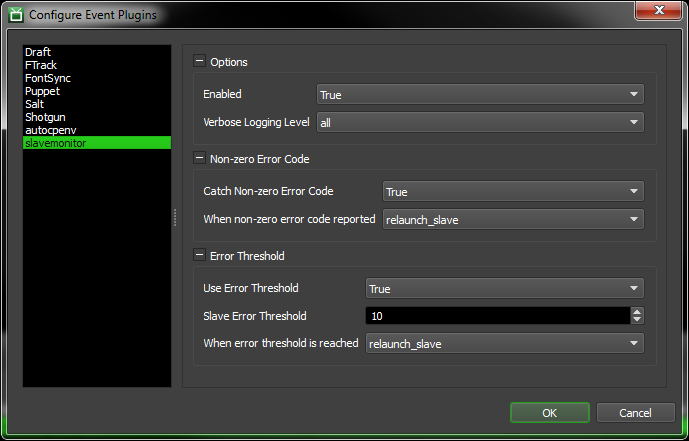

============
slavemonitor
============

Deadline Event Plugin that listens for OnJobError events and responds by performing an action on the slave that reported the error. Actions like blacklist, relaunching the slave, or restarting the slave machine.

Installation
============
Clone this git repository into your Deadline repository's custom events location::

    cd DEADLINE_REPOSITORY_PATH/custom/events
    git clone https://github.com/danbradham/slavemonitor.git

Use git pull to upgrade slavemonitor::

    cd DEADLINE_REPOSITORY_PATH/custom/events/slavemonitor
    git pull origin master

Configuration
=============
Open Deadline Monitor and enable *super user* mode under the tools menu. Then open the *Configure Event Plugins* dialog from the tools menu.

Options
-------

- Enabled: set to True to enable slavemonitor
- Verbose Logging Level: logging level

Non-Zero Error Code
-------------------
Perform an action when the indecipherable error code -1073740777

- Catch Non-zero Error Code: enable/disable non-zero error code action
- When non-zero error code reported: action to take when non-zero error code presents itself

Error Threshold
---------------

- Use Error Threshold: enable/disable error threshold action
- Slave Error Treshold: number of errors a slave must log for a job before performing action
- When error threshold is reached: action to take once threshold is reached
